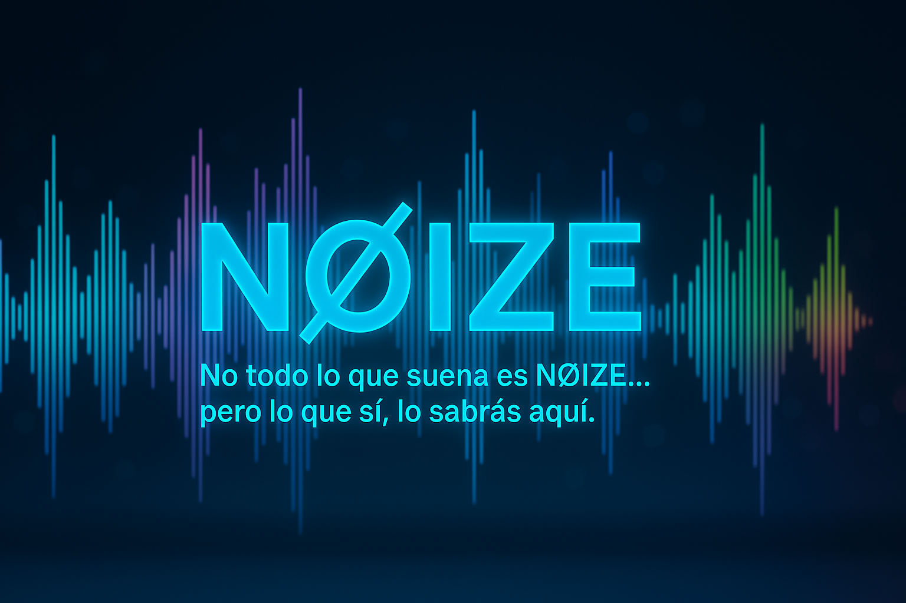

# NØIZE 🎶 

## Slogan
*"No todo lo que suena es NØIZE, pero lo que sí, lo sabrás aquí."*

## Introducción
¿Sabías que más del **80%** de las canciones que se lanzan nunca llegan a tener éxito?  
La industria musical está en constante crecimiento, y con miles de canciones subidas diariamente, identificar un hit se ha convertido en un desafío.  

### 🚀 Presentando NØIZE  
Nos emociona compartir contigo una aplicación que revolucionará el mundo de la música y la creatividad: **NØIZE**.

---

## 🎵 ¿Qué hace que una canción sea popular?
El éxito de una canción **suele ser una incógnita**, pero NØIZE se basa en datos para ofrecerte una visión clara y precisa sobre el **potencial de éxito** de una canción.

### Lo que sabemos:
- 🌍 Cada día se suben miles de canciones a plataformas como **Spotify**.
- 🎤 Nacen **nuevos artistas** con ideas frescas y creativas.
- 💰 Grandes productoras y discográficas están dispuestas a **invertir en música**.
- 🔍 Solo falta conectar estos factores con **datos y tecnología**... ¡Aquí entra NØIZE!

---

## 🎯 ¿Qué nos hace únicos?
✅ **No intuimos, evaluamos.**  
✅ **Apostamos por el crecimiento de la industria musical.**  
✅ **En un mercado saturado, logramos marcar la diferencia.**  

Trabajamos con **miles y miles de datos**, analizando más de **100 géneros musicales diferentes** en todo el mundo.  
Pero lo más importante: analizamos **canciones exitosas reales**, identificando patrones que han conquistado al público.


---

## 🛠 Tecnologías utilizadas
NØIZE está impulsado por **Machine Learning**, permitiendo la evaluación precisa de canciones. Utilizamos:
- 📊 **pandas** para manipulación de datos.
- 🤖 **scikit-learn** para modelos de predicción.
- 💾 **joblib** para la carga de modelos.
- 🔧 **os** para gestión de archivos.

---

## 🏆 Beneficios: ¿Por qué elegir NØIZE?
🎶 **Queremos que tu música suene diferente.**  
🎧 **Desarrollado por y para profesionales de la industria musical.**  
🚀 **El éxito ya no es cuestión de suerte, ahora lo puedes predecir.**  

---

## 🔮 ¿Qué sigue para NØIZE?
En el futuro, NØIZE planea **integrarse con plataformas como Spotify o TikTok** para recomendaciones **en tiempo real**.  

### 🔥 ¿Te atreves a predecir el éxito?

---

## 📌 Instalación
Si deseas probar NØIZE en tu entorno local, sigue estos pasos:

1. Clona el repositorio:
   ```bash
   git clone https://github.com/Cristianvas198/NOIZE

2. Ejecuta la aplicación:
   streamlit run app.py


## 📞 Contacto
Si tienes dudas o sugerencias, no dudes en escribirme a: (https://www.linkedin.com/in/cristiangvm98/)

### 🔥 ¡Esperamos que NØIZE te ayude a transformar el mundo de la música! 🚀🎶
